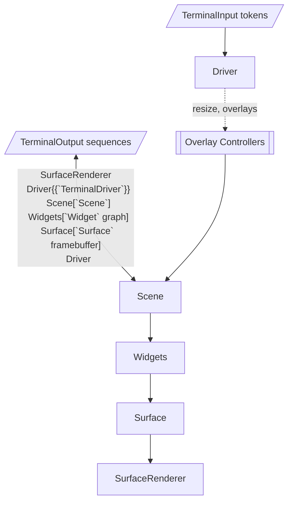
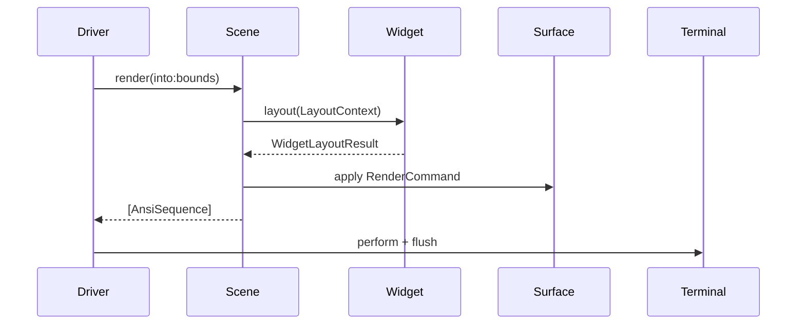

# CodexTUI Architecture

CodexTUI is a composable terminal UI framework layered around a declarative widget tree, a retained framebuffer, and a runtime that brokers terminal I/O. This document explains how those pieces collaborate so you can confidently extend the framework or embed it inside an application.

## System overview

The framework is organised into loosely coupled subsystems:



* **Runtime** – `TerminalDriver` orchestrates raw terminal mode, dispatch queues, and rendering. It owns the framebuffer and knows about resize signals and keyboard routing.
* **Scene graph** – `Scene` and the root `Widget` tree describe what should be on screen and provide layout contexts to every component.
* **Components** – Every visual element conforms to `Widget` and emits `RenderCommand` values that eventually become ANSI escape sequences.
* **Rendering** – The `Surface` framebuffer caches the last frame and computes diffs that `SurfaceRenderer` turns into efficient terminal updates.
* **Input** – Focusable widgets register with a `FocusChain`. Specialized controllers (menu, text entry, etc.) temporarily capture input and expose overlays.
* **Styling** – Themes supply consistent `ColorPair` palettes for widgets and overlays.

## Rendering pipeline

1. `CodexTUI.makeDriver(scene:configuration:)` wires a `TerminalDriver` to `TerminalInput`/`TerminalOutput`, so the caller only provides a scene graph.【F:Sources/CodexTUI/CodexTUI.swift†L6-L17】
2. When `start()` runs, the driver enables raw mode, subscribes to resize signals, and performs the first render. Later `resume()`/`suspend()` mirror that lifecycle.【F:Sources/CodexTUI/Runtime/TerminalDriver.swift†L36-L122】
3. Each frame, `scene.render(into:bounds:)` lays out the widget tree, gathers their `RenderCommand`s (parents first, children depth-first), applies them to the framebuffer, and diff-produces ANSI sequences.【F:Sources/CodexTUI/Scenes/Scene.swift†L37-L86】【F:Sources/CodexTUI/Components/Widget.swift†L16-L58】【F:Sources/CodexTUI/Rendering/Surface.swift†L17-L118】【F:Sources/CodexTUI/Rendering/Surface.swift†L119-L174】
4. The driver writes the generated sequences to the terminal, optionally in the alternate buffer and with the cursor hidden, so the UI feels like a full-screen application.【F:Sources/CodexTUI/Runtime/TerminalDriver.swift†L154-L205】

### Frame lifecycle



## Widget system

`Widget` is the core protocol: given a `LayoutContext`, produce a `WidgetLayoutResult`. Results include the widget’s own commands and any child results so render order stays deterministic.【F:Sources/CodexTUI/Components/Widget.swift†L31-L58】

### Type erasure and focus

* `AnyWidget` wraps heterogeneous widgets while preserving value semantics.【F:Sources/CodexTUI/Components/Widget.swift†L33-L50】
* Focusable widgets adopt `FocusableWidget`, expose a `FocusIdentifier`, and register a `FocusNode` with the scene-wide `FocusChain`. The chain tracks the active node, supports tab traversal, and snapshots its state for layout consumers.【F:Sources/CodexTUI/Components/Widget.swift†L52-L64】【F:Sources/CodexTUI/Input/FocusChain.swift†L5-L92】

### Composing layouts

Widgets commonly reuse helper structures:

* `LayoutContext` bundles the assigned bounds, current theme, focus snapshot, and scene `EnvironmentValues`. Widgets may propagate or override the environment for children.【F:Sources/CodexTUI/Layout/LayoutContext.swift†L5-L38】
* `BoxBounds` centralises terminal geometry, offers inset/alignment helpers, and works with `EdgeInsets` for padding.【F:Sources/CodexTUI/Layout/BoxBounds.swift†L5-L73】

`Scaffold` demonstrates composition: it reserves rows for the menu/status bars (if present) and forwards tailored contexts to each child, leaving the remaining area for the main content.【F:Sources/CodexTUI/Components/Scaffold.swift†L5-L52】

## Focus and input routing

The driver consumes raw tokens and routes them in priority order:

1. Overlay controllers (text entry, message box, selection list, menu) get the first chance to handle input. If any consume the token they request a redraw so the scene reflects the new state.【F:Sources/CodexTUI/Runtime/TerminalDriver.swift†L124-L170】
2. Otherwise the driver invokes the `onKeyEvent` callback so application logic can react.

Controllers temporarily stash the scene’s overlays and active focus, present specialised widgets, and restore state on dismiss. For example, `TextEntryBoxController` swaps overlays, captures text edits, and re-focuses the previous widget once the dialog closes.【F:Sources/CodexTUI/Runtime/TextEntryBoxController.swift†L5-L120】【F:Sources/CodexTUI/Runtime/TextEntryBoxController.swift†L121-L204】 `MenuController` performs similar bookkeeping for dropdown menus, moving between menu items and entries, and generating overlays anchored to menu bounds.【F:Sources/CodexTUI/Runtime/MenuController.swift†L5-L154】

### Focus snapshots in layout

Because layout is pure, widgets never mutate focus directly. Instead they inspect `LayoutContext.focus` (a `FocusChain.Snapshot`) to decide whether they should render as active/highlighted. Any focus changes happen through the controllers or the scene’s registration APIs.【F:Sources/CodexTUI/Layout/LayoutContext.swift†L5-L24】【F:Sources/CodexTUI/Scenes/Scene.swift†L21-L48】

## Overlay presentation

Scenes own the base widget plus an optional array of overlays. Overlay presenters (controllers or custom logic) push `Overlay` widgets that render in their own coordinate spaces but still share the theme and focus context.【F:Sources/CodexTUI/Scenes/Scene.swift†L21-L86】【F:Sources/CodexTUI/Components/Overlay.swift†L5-L21】 Widgets such as `SelectionListSurface`, `ModalDialogSurface`, and `TextEntryBox` provide ready-made overlays for common UI patterns.

## Styling

`Theme` aggregates `ColorPair` values for core UI surfaces (menu bar, status bar, window chrome, highlight, etc.). Widgets respect the active theme provided via their `LayoutContext`. Because `ColorPair` is value-based, themes can be swapped at runtime without mutating widget logic.【F:Sources/CodexTUI/Styling/Theme.swift†L5-L47】 `SurfaceRenderer` consults each tile’s `ColorPair` to emit the precise ANSI style sequences, resetting where necessary to avoid attribute bleed.【F:Sources/CodexTUI/Rendering/Surface.swift†L119-L174】

## Terminal integration

`TerminalModeController` captures the original termios attributes, toggles raw mode, and restores settings when the driver stops or suspends. `SignalObserver` wraps `DispatchSourceSignal` so the runtime can react to `SIGWINCH` resizes on the main queue. The driver also switches between the terminal’s primary/alternate buffers, clears scrollback, and toggles cursor visibility based on the runtime configuration.【F:Sources/CodexTUI/Platform/TerminalModeController.swift†L5-L48】【F:Sources/CodexTUI/Platform/SignalHandling.swift†L5-L54】【F:Sources/CodexTUI/Runtime/TerminalDriver.swift†L174-L205】

## Working with text content

`TextBuffer` illustrates how focusable, scrollable content is built: it stores all lines, clamps the scroll offset within bounds, and emits `RenderCommand`s for visible characters only. Focus integration is optional—interactive buffers register in the focus chain so keyboard shortcuts can target them.【F:Sources/CodexTUI/Components/TextBuffer.swift†L5-L57】【F:Sources/CodexTUI/Components/TextBuffer.swift†L58-L99】

## Building scenes

Applications typically assemble a scene with the helper `Scene.standard(menuBar:content:statusBar:configuration:focusChain:overlays:)`. That factory wraps your content inside a `Scaffold` while preserving default configuration and focus chain instances. Overlays supplied at creation time render above the scaffold content in depth order.【F:Sources/CodexTUI/Scenes/Scene.swift†L5-L86】

### Example

```swift
import CodexTUI
import TerminalInput
import TerminalOutput

let focusChain = FocusChain()
let textView   = TextBuffer(
  identifier: FocusIdentifier("log"),
  lines: ["CodexTUI ready"],
  isInteractive: true,
  style: Theme.defaultContent,
  highlightStyle: Theme.defaultHighlight
)

let scene = Scene.standard(
  menuBar : MenuBar(
    items            : [
      MenuItem(title: "File", activationKey: .control(.F), entries: [
        MenuItem.Entry(title: "Quit", acceleratorHint: "Ctrl+C", action: { /*...*/ })
      ])
    ],
    style            : Theme.defaultMenuBar,
    highlightStyle   : Theme.defaultHighlight,
    dimHighlightStyle: Theme.defaultDimHighlight
  ),
  content  : AnyWidget(textView),
  statusBar: StatusBar(
    items            : [StatusBar.Item(text: "Ready", alignment: .leading)],
    style            : Theme.defaultStatusBar
  ),
  configuration: SceneConfiguration(theme: .codex),
  focusChain   : focusChain
)

let driver = CodexTUI.makeDriver(scene: scene)
driver.onKeyEvent = { token in
  switch token {
    case .control(.C): driver.stop()
    default           : break
  }
}

driver.start()
```

* Construct focusable widgets and register them with the scene (directly or via the helper) so traversal works.
* Use overlay controllers (e.g. `driver.textEntryBoxController`) to present modals without manually managing overlay stacks.

## Extending the framework

1. Implement `Widget.layout(in:)` using the provided geometry and theme helpers. Return child `WidgetLayoutResult`s to preserve paint order.
2. Register focusable components with the `Scene` during setup so keyboard navigation works naturally.
3. Leverage `EnvironmentValues` to pass layout metadata (padding, chrome heights) without threading extra parameters through initialisers.
4. When introducing new overlay types, follow the controller pattern: capture existing overlays, insert your overlay widget, and restore scene state on dismiss.

With this mental model, you can reason about how a keypress eventually becomes a diffed framebuffer update, and where to slot additional behaviour without violating CodexTUI’s composable design.
